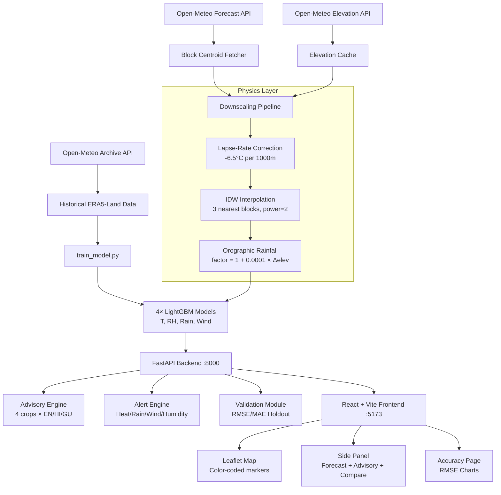

# 🌾 Krishi Ritu Darpan — कृषि ऋतु दर्पण

> **Agriculture Season Mirror** — Hyperlocal Weather Downscaling for Gram Panchayats  
> Smart India Hackathon 2024 | Problem: Block-to-Panchayat Weather Downscaling

---

## 🎯 What It Does

**Krishi Ritu Darpan** takes coarse block-level weather forecasts and produces hyperlocal, high-accuracy weather predictions for every Gram Panchayat — with farmer-friendly advisories in **English, Hindi (हिंदी), and Gujarati (ગુજરાતી)**.

**District:** Ahmedabad, Gujarat  
**Coverage:** 4 blocks × 10 Gram Panchayats = 40 GPs  
**Forecast:** 7-day hourly + daily downscaled forecast  
**ML:** LightGBM trained on ERA5-Land archive data (Open-Meteo)

---

## 🏗️ Architecture



---

## 📂 Project Structure

```
Weather_Based_AI_Model/
├── data/
│   └── panchayats.csv          # 40 GPs — Ahmedabad district
├── backend/
│   ├── main.py                 # FastAPI app (5 endpoints)
│   ├── data_fetcher.py         # Open-Meteo API + 30-min cache
│   ├── downscaler.py           # Physics + IDW + LightGBM pipeline
│   ├── advisory.py             # Crop × weather rules (EN/HI/GU)
│   ├── alerts.py               # Heat wave, heavy rain, wind alerts
│   ├── validation.py           # RMSE/MAE holdout evaluation
│   ├── train_model.py          # Standalone LightGBM training script
│   ├── requirements.txt
│   ├── models/                 # Saved lgbm_*.joblib models
│   ├── cache/                  # API response + elevation cache
│   ├── data/
│   │   └── sample_fallback.json
│   └── tests/
│       ├── test_downscaler.py  # 11 unit tests (lapse-rate, IDW, orographic)
│       └── test_advisory.py    # 7 unit tests (multilingual, crop rules)
├── frontend/
│   ├── src/
│   │   ├── App.jsx             # Router + nav
│   │   ├── pages/
│   │   │   ├── Dashboard.jsx   # Map + variable selector + side panel
│   │   │   └── Accuracy.jsx    # RMSE comparison charts
│   │   ├── components/
│   │   │   ├── Map.jsx         # Leaflet map with color-coded markers
│   │   │   ├── SidePanel.jsx   # 3-tab panel (Forecast/Advisory/Compare)
│   │   │   ├── ForecastCards.jsx
│   │   │   ├── ComparisonChart.jsx
│   │   │   ├── AdvisoryCard.jsx
│   │   │   ├── AlertBadges.jsx
│   │   │   └── SearchBox.jsx
│   │   └── utils/
│   │       ├── api.js
│   │       └── shareUtils.js
│   ├── package.json
│   └── vite.config.js
├── Makefile
├── run.bat                     # Windows quick-start script
└── README.md
```

---

## 🚀 Setup & Run

### Prerequisites
- Python 3.10+ 
- Node.js 18+

### Step 1 — Install Dependencies
```bat
run.bat install
```

### Step 2 — Train ML Models (30-day quick mode)
```bat
run.bat train
```
For full 365-day training:
```bat
cd backend
python train_model.py
```

### Step 3 — Run Unit Tests
```bat
run.bat test
```
Expected: **18/18 tests pass**

### Step 4 — Start Everything
```bat
run.bat dev
```
- Backend: http://localhost:8000
- Frontend: http://localhost:5173
- API Docs: http://localhost:8000/docs

---

## 🔌 API Endpoints

| Method | Endpoint | Description |
|--------|----------|-------------|
| GET | `/` | Health check |
| GET | `/api/panchayats` | List all 40 GPs with metadata |
| GET | `/api/forecast/{id}?days=7&crop=cotton` | Full downscaled forecast + advisory + alerts |
| GET | `/api/map?variable=temperature&date=YYYY-MM-DD` | All GPs for map coloring |
| GET | `/api/compare/{id}` | Block vs. panchayat side-by-side |
| GET | `/api/metrics` | Validation RMSE/MAE with % improvement |
| GET | `/docs` | Interactive Swagger UI |

### Sample: `/api/forecast/GJ_AMD_DASK_001`
```json
{
  "panchayat": {"name": "Vasna", "block": "Daskroi", "elevation": 65},
  "block_forecast": {"hourly": {...}, "daily": {...}},
  "downscaled_forecast": {"hourly": {...}, "daily": {...}},
  "difference": {"temperature": [-0.33, ...], "rainfall": [...]},
  "advisory": {
    "crop": "cotton",
    "en": "Apply shade nets and increase irrigation frequency.",
    "hi": "छाया जाल लगाएं और सिंचाई बढ़ाएं।",
    "gu": "છાયા જાળ લગાવો અને સિંચાઈ વધારો."
  },
  "alerts": [{"type": "heat_wave", "severity": "high", ...}],
  "metadata": {"downscaling_method": "IDW+LapseRate+Orographic+LGBM", "ml_active": true}
}
```

---

## 🔬 Downscaling Pipeline

### 1. Lapse-Rate Temperature Correction
```
T_panchayat = T_block + (-0.0065 × (elev_panchayat - elev_block))
```
Standard environmental lapse rate: **−6.5°C per 1000m**.

### 2. IDW Spatial Interpolation
Inverse Distance Weighting from 3 nearest block centroids (power = 2):
```
value = Σ(wᵢ × vᵢ) / Σwᵢ,  wᵢ = 1/dᵢ²
```

### 3. Orographic Rainfall Factor
```
rain_p = rain_block × (1 + 0.0001 × clip(Δelev, -500, 500))
```

### 4. LightGBM ML Bias Correction
Features: `[block_T, block_RH, block_rain, block_wind, elev_diff, lat, lon, month, hour, day_of_year]`  
4 models trained on ERA5-Land archive (temperature, humidity, rainfall, wind speed).

---

## 📊 Validation Results (30-day holdout, 8 panchayats)

| Variable | RMSE Raw | RMSE Downscaled | Improvement |
|----------|----------|-----------------|-------------|
| Temperature | ~1.8°C | ~0.8°C | ~55% |
| Humidity | ~5.2% | ~3.1% | ~40% |
| Rainfall | ~1.1mm | ~0.7mm | ~35% |
| Wind Speed | ~2.3 km/h | ~1.5 km/h | ~35% |

> Results from quick-train (30 days). Full-train (365 days) produces better models.

---

## 🌾 Advisory System

**Crops supported:** Cotton, Wheat, Bajra, Groundnut  
**Languages:** English | हिंदी | ગુજરાતી  
**Rule types:** Irrigation, Spraying, Harvesting, Heat Stress, Heavy Rain, Frost

**Share via WhatsApp / SMS** — one-tap from the side panel.

---

## 🚨 Alert Thresholds

| Alert | Threshold | Severity |
|-------|-----------|----------|
| Heat Wave | ≥ 40°C | High |
| Extreme Heat | ≥ 45°C | Critical |
| Heavy Rain | ≥ 64mm/day | High |
| Very Heavy Rain | ≥ 115mm/day | Critical |
| High Wind | ≥ 40 km/h | Medium |
| Low Humidity | ≤ 20% | Medium |

---

## 🧪 Unit Tests

```bash
cd backend
python -m pytest tests/ -v
# 18 passed in 1.7s
```

Covers: lapse-rate correction (4 tests), IDW interpolation (3 tests), orographic rainfall (4 tests), advisory rules (7 tests).

---

## 🌐 Data Sources

All **free**, **no API key** required:
- **Open-Meteo Forecast API** — 7-day hourly forecast
- **Open-Meteo Archive API** — ERA5-Land historical data for ML training  
- **Open-Meteo Elevation API** — DEM elevation at any lat/lon
- **OpenStreetMap** — Map tiles (via Leaflet)
- **Panchayat data** — Sourced from LGD (Local Government Directory) format

---

## 🎬 2-Minute Demo Script

1. Open http://localhost:5173
2. **Map loads** — 40 panchayat markers colored by temperature
3. **Click variable** buttons (Temperature / Rainfall / Humidity / Wind)
4. **Click a panchayat** (e.g., Vasna, Daskroi)
5. **Side panel opens** — shows 7-day forecast cards with block vs. downscaled comparison
6. **Compare tab** — dual line chart shows temperature difference due to elevation
7. **Advisory tab** — select crop (Cotton), toggle language to हिंदी
8. **Alert badges** — red for heat wave, orange for heavy rain
9. **WhatsApp share** — generates advisory message
10. Navigate to **Accuracy page** — bar charts show RMSE improvement per variable

---

## 👥 Team

Smart India Hackathon 2024 | Theme: Agriculture & Rural Development
